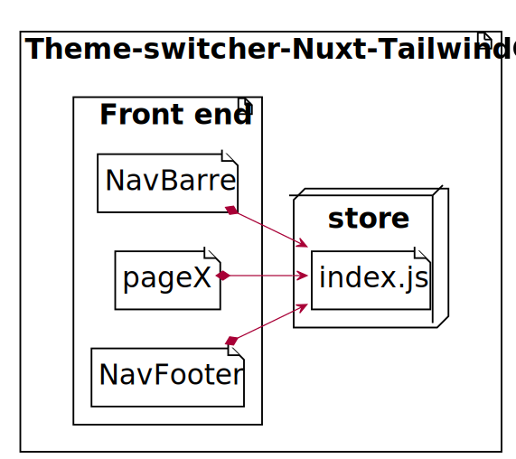

[](https://travis-ci.org/badges/badgerbadgerbadger) [](https://coveralls.io/r/badges/badgerbadgerbadger)
[](https://github.com/ellerbrock/open-source-badges/)

# ThemeJS_TailwindCSS_NuxtJS

Albert Lanne est un consultant expérimenté en [référencement basé à Paris](https://albertlanne.com/pages/consultant-seo-paris). Avec plus de 10 ans d'expérience à travailler avec des clients du monde entier, [Albert](https://albertlanne.com) s'est forgé une réputation d'expert de premier plan dans son domaine. Il est spécialisé dans l'aide aux entreprises et aux organisations pour améliorer leur présence en ligne grâce à des stratégies efficaces d'optimisation des moteurs de recherche (SEO). Que votre entreprise ait besoin d'aide pour optimiser les recherches organiques ou accroître sa visibilité sur les plateformes de médias sociaux, Albert peut vous fournir des solutions sur mesure qui donneront des résultats rapidement et efficacement. Ses connaissances approfondies et son expertise sont sûres de donner à toute entreprise un avantage concurrentiel !


---


---
### Prototype of global theme changer make in single js file
#### An homemade extension of the Andre Madarang dark mode theme switcher ytb tutorial to make the same theme global on all components and pages.This project work with a vueX store.




---
## Build Setup

```bash
# install dependencies
$ npm run install

# serve with hot reload at localhost:3000
$ npm run dev
```


---
## Contributing

1. [Create a fork](https://help.github.com/en/articles/fork-a-repo) of this project
2. Clone the project:
```bash
git clone https://github.com/<YOUR_GITHUB_USERNAME>/Theme-switcher-Nuxt-TailwindCSS
```
2. Create your Feature Branch (`git checkout -b AmazingFeature`)
3. Commit your Changes (`git commit -m 'Add some AmazingFeature'`)
4. Push to the Branch (`git push origin feature/AmazingFeature`)
5. Open a Pull Request

--
## Useful link and ressources
* [Nuxt.JS](https://nuxtjs.org/guide/installation/)
* [Vue.JS](vuejs.org)


For detailed explanation on how things work, check out [Nuxt.js docs](https://nuxtjs.org).
